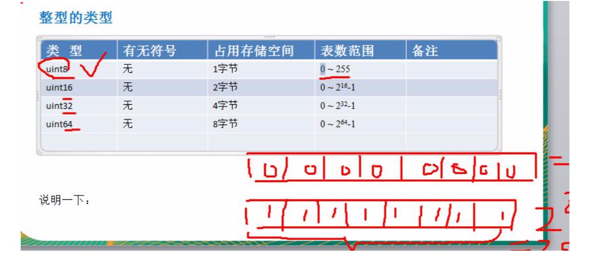

# 整数类型

## 基本介绍

  简单的说，就是用于存放整数值的，比如 0, -1, 2345 等等。
  
  
## 整数的各个类型


```go
package main
// import "fmt"
// import "unsafe"
import (
	"fmt"
	"unsafe"
)


//演示golang中整数类型使用
func main() {
	
	var i int = 1
	fmt.Println("i=", i)

	//测试一下int8的范围 -128~127,
	//其它的 int16, int32, int64,类推。。。
	var j int8 = 127
	fmt.Println("j=", j)
	}
```

- int 的无符号的类型 (静态类型unsign)


```go
//测试一下 uint8的范围(0-255),其它的 uint16, uint32, uint64类推即可
	var k uint16 = 255
	fmt.Println("k=", k)
```
- int 的其它类型的说明:

```go
//int , uint , rune , byte的使用
	var a int = 8900
	fmt.Println("a=", a)
	var b uint = 1
	var c byte = 255
	fmt.Println("b=", b, "c=", c)
```
## 整型的使用细节

- Golang 各整数类型分:有符号和无符号，int uint 的大小和系统有关。
- Golang 的整型默认声明为 int 型
```go
//整型的使用细节
	var n1 = 100 // ? n1 是什么类型
	//这里我们给介绍一下如何查看某个变量的数据类型
	//fmt.Printf() 可以用于做格式化输出。
	fmt.Printf("n1 的 类型 %T \n", n1)
```
- 如何在程序查看某个变量的字节大小和数据类型 (使用较多)
```go
	//如何在程序查看某个变量的占用字节大小和数据类型 （使用较多）
	var n2 int64 = 10
	//unsafe.Sizeof(n1) 是unsafe包的一个函数，可以返回n1变量占用的字节数
	fmt.Printf("n2 的 类型 %T  n2占用的字节数是 %d ", n2, unsafe.Sizeof(n2))

```
- Golang程序中整型变量在使用时，遵守保小不保大的原则，即:在保证程序正确运行下，尽量 使用占用空间小的数据类型。【如:年龄】
```go
 //  Golang程序中整型变量在使用时，遵守保小不保大的原则，即:在保证程序正确运行下，尽量 使用占用空间小的数据类型。【如:年龄】
 var age byte = 90
```
- bit: 计算机中的最小存储单位。byte:计算机中基本存储单元。[二进制再详细说] 1byte = 8 bit